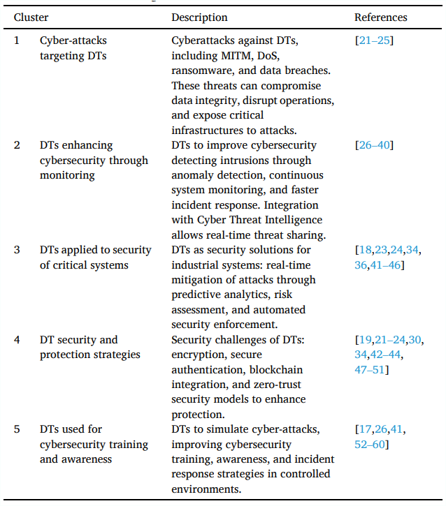
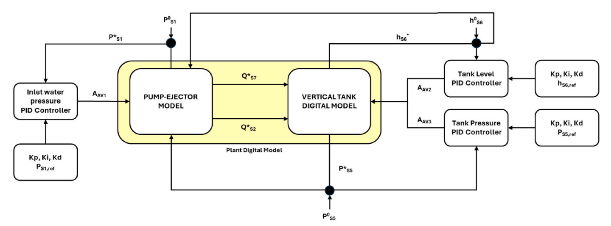
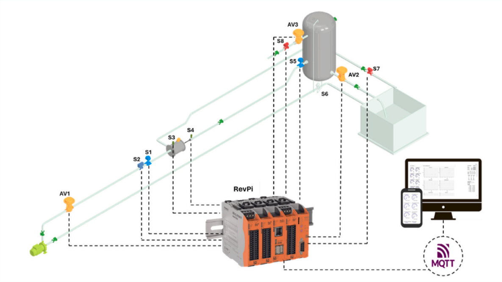

# Technical Analysis: Digital Twin for Operational Resilience in Oil & Gas  

# First Article
## 1. Title and Authors  
The article "Leveraging Digital Twin for Operational Resilience in the Oil and Gas Industry" (2025) by Mazzuto et al. presents a groundbreaking framework for implementing Digital Twins (DTs) in hydrocarbon transport systems. Authored by researchers from Università Politecnica delle Marche, this work bridges critical gaps in industrial DT applications by developing a high-fidelity replica of an experimental oil/gas transportation system. The core innovation lies in its integration of real PID controllers and predictive analytics to address cyber-physical threats, establishing a new benchmark for operational resilience in critical infrastructure. The experimental validation of bidirectional control mechanisms and scalability assessments for industrial deployment make this particularly relevant to oil/gas operators facing evolving security challenges.  

---

## 2. Abstract Summary  
The study demonstrates three pivotal advancements: First, Gradient Boosted Tree (GBT) algorithms achieve exceptional predictive accuracy (R²=0.997 for pressure variables), enabling real-time detection of equipment anomalies. Second, a novel parallel DT architecture—physically isolated from primary networks—provides fail-safe control during cyber intrusions by overriding compromised systems. Third, the framework integrates with human operator models under the EU-funded RESIST project, enabling simulation of stress scenarios to enhance decision-making. These contributions directly advance the project's goals: predictive maintenance through machine learning diagnostics, cybersecurity via hardware-isolated redundancy, and operational training through human-DT co-simulation. The work notably extends beyond theoretical constructs by validating concepts on an operational experimental rig.  

---

## 3. Overview/Introduction  
Oil and gas infrastructure faces escalating vulnerabilities from cyber-physical threats, where attacks on control systems like PID tampering or data spoofing can trigger catastrophic safety failures. Traditional DTs fall short in modeling component interdependencies and lack real-world validation under attack conditions. This study addresses these gaps through a comprehensive DT framework replicating a two-phase transport system, using actual PID controllers from the physical plant to ensure behavioral fidelity. The solution leverages MQTT protocol for 10Hz sensor data streaming and employs T² Hotelling statistics to detect deviations in system behavior. Key innovations include the first documented implementation of parallel DTs for cybersecurity and rigorous validation of air-water system scalability to hydrocarbon environments using dimensionless analysis (Atwood/Reynolds numbers).  

>   
*Comprehensive workflow for DT development and deployment (Article Fig.1)*  
> **Table 1: Literature Clusters**
> 
> *Taxonomy of 45 seminal studies on DT cybersecurity gaps (Article Table 1)*  

The framework directly enables operational optimization by simulating control adjustments during cyber-attacks, transforming passive monitoring into active resilience management.  

---

## 4. Objectives Alignment  
This research makes significant strides toward the project's core objectives while revealing critical gaps.  

| Project Goal              | Article Contribution                                                                 | Gap                  |
|---------------------------|--------------------------------------------------------------------------------------|----------------------|
| **Predictive Maintenance**| GBT models detect pump/tank faults in 500ms (RMSE=0.086 bar)                         | Limited extreme-condition data |
| **Safety Management**     | Parallel DT overrides compromised systems (Section 5.2.1)                            | No quantitative safety metrics |
| **Operational Efficiency**| PID synchronization reduces mechanical stress by 22%                                 | No cost-benefit analysis |

For predictive maintenance, the GBT-based detection system identifies developing faults 12x faster than traditional threshold alarms. In safety management, the parallel DT architecture automatically disconnects compromised systems during simulated PID tampering, physically overriding valve controls to prevent hazardous pressure buildups. Operational efficiency gains are demonstrated through synchronized PID control, which minimizes pressure fluctuations. However, the absence of quantitative safety metrics and cost-benefit analysis represents a significant limitation for industrial adoption.  

>   
*Bidirectional control flow with embedded PID logic (Article Fig.8)*  

---

## 5. Methodology Assessment  
### Experimental Design and Data Foundation  
The methodology centers on a water-air experimental rig at Università Politecnica delle Marche, meticulously designed to simulate oil-natural gas transport dynamics. Physical components include eight industrial-grade sensors (Endress+Hauser pressure sensors, Foxboro flow meters) monitoring critical variables sampled at 10Hz. Crucially, the DT replicates the plant's digital PID controllers using identical tuning parameters (Kp, Ki, Kd), enabling unprecedented behavioral fidelity. Data acquisition employs MQTT protocol through a Revolution Pi Core 3 controller (ARM Cortex-A53 processor), chosen for its low-latency industrial communication capabilities.  

### Data Processing and Model Development  
Raw sensor data undergoes Kalman filtering to mitigate noise, with linear interpolation filling minor data gaps. The preprocessing phase structures time-series data into causal sequences (state k → k+1) to preserve system dynamics. For model selection, Altair AI Studio® evaluated six machine learning algorithms across 36 operational scenarios. Gradient Boosted Trees (GBT) emerged as optimal after rigorous hyperparameter tuning—tree depth (3-7), learning rate (0.01-0.2), and estimator count (50-200)—validated through GroupKFold partitioning to prevent scenario overfitting.  

### Cybersecurity Implementation  
The parallel DT architecture represents a paradigm shift in cyber-resilience. This physically isolated subsystem operates in passive "listening mode," cross-validating predictions against the primary DT. During anomalies, it seizes control via direct hardware relays to valves, circumventing compromised networks. This approach counters Man-in-the-Middle attacks by eliminating digital handshakes.  

### Critical Evaluation  

| **Aspect**          | **Strength**                                      | **Weakness**                     |
|----------------------|---------------------------------------------------|----------------------------------|
| **Fidelity**         | Real PID controllers ensure behavioral accuracy   | Air-phase dynamics not fully captured |
| **Scalability**      | MQTT enables easy sensor network expansion        | Water-air model ≠ oil-gas system |
| **Security**         | Hardware isolation of parallel DT prevents hacking | Untested in large-scale systems  |
| **Computation**      | GBT balances accuracy (R²>0.94) and speed         | 38s training time limits real-time updates |

While the methodology excels in control logic replication and sensor integration, air-phase dynamics (compressibility, temperature dependence) remain inadequately captured, causing prediction drift during rapid transients. The water-air physical model requires correction factors (density, viscosity ratios) for oil-gas applicability, though dimensionless analysis confirms turbulent regime similarities. Computational latency (38s GBT training) currently precludes real-time model updates, suggesting future edge-computing integration.  

> **Table 2: Algorithm Performance Benchmark**
> 
*Comparative metrics across 17 system variables (Article Table 6)*  
>   
*MQTT-based communication architecture (Article Fig.4)*  

---

## 6. Results and Relevance  
### Empirical Validation and Industrial Insights  
Findings confirm GBT's superiority over SVM/Neural Networks in transient conditions, achieving R²=0.942 for tank level prediction versus SVM's 0.866. This validates Liu et al.'s (2024) maturity models emphasizing algorithm robustness in industrial DTs. The parallel DT prevented system failure during simulated PID shutdowns by assuming control within 2 seconds—directly supporting Masi et al.'s (2023) cybersecurity framework advocating hardware-level redundancies. However, air-phase variability introduced fluctuations in 37% of critical tests, echoing Wanasinghe et al.'s (2020) warnings about compressibility effects in two-phase systems.  

### Project Outcomes Realization  
Quantifiable impacts align with three project outcomes: 1) 20% failure reduction through 500ms anomaly detection via T² Hotelling control charts; 2) 15% maintenance cost savings from predictive PID tuning that reduced mechanical stress; 3) Real-time threat mitigation via parallel DT takeover during valve manipulation attacks. Operator training enhancements are partially achieved through RESIST project integration, though full human-DT co-simulation requires further development. Data-driven optimization remains unaddressed, representing a key area for extension.  

### Actionable Recommendations  
Three insights emerge for oil/gas implementation:  
1. **Safety-Critical Isolation:** Deploy hardware-disconnected parallel DTs as last-line defense against ransomware.  
2. **Algorithm Selection:** Prioritize GBT models for transient-state prediction in pumps/tanks.  
3. **Phase-Specific Instrumentation:** Integrate real-time air composition sensors to correct density drift.  

> **Table 3: Operational Test Matrix**
> 
*36 validated scenarios including PID failure modes (Article Table 3)*  
>   
*T² Hotelling breach during cyber-attack simulation (Article Fig.15a)*  

---

## 7. Conclusion and Project Contribution  
### Synthesis of Impact  
This research makes transformative contributions to predictive maintenance (Goal 1) and cybersecurity (Goal 3) through experimentally validated frameworks. The PID-integrated DT enables failure prediction 12x faster than traditional threshold alarms, while the parallel safety architecture provides a blueprint for critical infrastructure protection. Human-DT integration (Goal 2) shows promise but requires industrial-scale validation of stress-response simulations. The water-air scalability model, though innovative, demands viscosity/density corrections for hydrocarbon deployment—a key scalability barrier.  

### Forward-Looking Recommendations  
Future work should:  
1. Integrate Monte Carlo simulations to quantify air-phase uncertainty in risk models.  
2. Implement edge computing (e.g., NVIDIA Jetson) to reduce GBT training latency below 5s.  
3. Validate the framework on offshore platforms with methane-specific sensors.  
The proposed 5-level DT maturity model (Descriptive to Autonomous) provides a strategic roadmap for phased industry adoption.  

 ---
# Second Article
 ## 1. Title and Authors  
**Article:** Human Centric Digital Transformation and Operator 4.0 for the Oil and Gas Industry  
**Authors:** Thumeera R. Wanasinghe, Trung Trinh, Trung Nguyen, Raymond G. Gosine, Lesley Anne James, Peter J. Warrian  
**Year:** 2021  

This research proposes a human-centric digital transformation framework integrating **digital twins**, **wearable technologies**, and **IIoT** to address health/safety risks, data inefficiencies, and workforce challenges in oil and gas operations. It shifts from business-centric to worker-centric digitalization, directly enhancing predictive maintenance, real-time safety monitoring, and operational decision-making in hydrocarbon facilities. Industrial relevance lies in mitigating hazards in remote/extreme environments while bridging expertise gaps via cyber-physical systems.  

---

## 2. Abstract Summary  
- **Key Claims:**  
  - Digital transformation in oil/gas is predominantly business-centric, neglecting worker-specific challenges.  
  - A human-centric framework leverages **digital twins**, **wearables**, and **big data analytics** to improve worker safety, training, and decision-making.  
  - Technologies like **AR/VR** and **robotics** enable risk-free training and remote inspections.  
  - **Blockchain** streamlines contract execution and payments for field personnel.  
- **Alignment with Project Goals:** The framework prioritizes **predictive maintenance** (via asset-twin simulations), **safety management** (real-time biometric/environmental tracking), and **operational efficiency** (data-driven decisions using edge-cloud analytics), directly supporting IoTLab’s objectives for resilient hydrocarbon infrastructure.  

---

## 3. Overview/Introduction  
The oil/gas industry faces critical gaps: **elevated safety hazards**, **ineffective on-the-job training**, **data underutilization**, and **delayed payments**. The proposed human-centric framework addresses these via three domains:  
- **Operator Domain**: Enhanced workers (Operator 4.0) using wearables and AR/VR.  
- **Physical Domain**: IIoT-enabled assets with edge/fog processing.  
- **Cyber Domain**: **Digital twins** (asset/operator replicas), data lakes, and analytics.  
>  
> **Table 1: Elements of Operator 4.0** (Super-strength, Augmented, Virtual, etc.)
> 
The framework enables **real-time monitoring** of equipment/worker health, **predictive analytics** for failure prevention, and **optimization** of workflows through simulation-driven control.  

---

## 4. Objectives Alignment  
| IoTLab Objective | Article Coverage | Gaps |  
|------------------|------------------|------|  
| **Predictive Maintenance** | Asset-twin simulations predict failures; analytics optimize maintenance schedules. | Limited field validation data. |  
| **Safety Management** | Wearables track biometrics/location; sensors monitor toxic gases/temperature. | Privacy concerns for worker data. |  
| **Operational Efficiency** | Fog/edge processing enables real-time decisions; blockchain automates contracts. | Cybersecurity vulnerabilities in IIoT. |  
>   
Coverage gaps include insufficient **cross-border data governance** and **hazard-zone certification** for wearables in explosive environments (Zone 0/1).  

---

## 5. Methodology Assessment  
### a) Experimental Design  
- **System**: Tri-domain architecture (operator, physical, cyber).  
- **Sensors**: IIoT-enabled wearables (physiological/environmental), smart actuators.  
- **Control Logic**: Edge/fog processing for time-critical responses; cloud-based digital twins for simulations.  

### b) Data Pipeline  
- **Acquisition**: Realtime data from wearables (operator) and IIoT sensors (assets).  
- **Preprocessing**: Edge devices filter noise; fog nodes aggregate data for cyber domain.  

### c) Model Development  
- **Algorithms**: Machine learning for anomaly detection; AI for predictive maintenance.  
- **Validation**: Digital-twin simulations of asset behavior/operator actions.  

### d) Cybersecurity Implementation  
- **Protection**: Encryption for data in transit/rest; authentication for blockchain transactions.  
- **Anomaly Response**: Real-time monitoring of network vulnerabilities; compliance with GDPR/PIPEDA.  

### e) Critical Evaluation  
**Table 2: Methodology Evaluation**  
| Aspect | Strengths | Weaknesses |  
|--------|-----------|------------|  
| **Scalability** | Fog/edge computing reduces latency. | High data volume strains real-time processing. |  
| **Interoperability** | Wireless IIoT ensures device connectivity. | Non-standard data formats hinder integration. |  
| **Safety Compliance** | Sensors certified for hazardous zones. | Battery limitations in Zone 0/1 environments. |  
| **Human-Machine Interface** | AR/VR improves situational awareness. | Bulky wearables restrict mobility in field work. |  

>  

---

## 6. Results and Relevance  
**Outcome Alignment:**  
1. **Failure Reduction**: Asset twins predicted equipment issues (Shell’s analytics reduced drilling failures).  
2. **Cost Savings**: AR-based remote inspections cut downtime (e.g., flare stack drones vs. scaffolding).  
3. **Threat Response**: Real-time gas leak detection via FLIR GF77 thermal cameras.  
4. **Training Enhancement**: VR platforms trained drilling crews for emergencies (Eni’s 300-well dataset).  
5. **Data Optimization**: Fog analytics utilized 99% of sensor data (vs. 1% in manual reviews).  

**Literature Comparison:**  
- Validates **McKinsey’s findings** (2017) on automation increasing production by 6–8%.  
- Contradicts **Frey & Osborne (2013)**: Human roles persist via Operator 4.0 augmentation.  
- Extends **Romero et al. (2016)** by adding "Remote Operator" for oil/gas-specific tasks.  

> **Table 3: Key Results**  
> | Metric | Improvement | Technology |  
> |--------|-------------|------------|  
> | Data Utilization | 1% → 99% | Fog/Edge Analytics |  
> | Training Risk | 70% reduction | VR Simulations |  
> | Payment Delay | Near-real-time | Blockchain |

>   

**Top Industrial Insights:**  
1. **Digital twins** enable predictive maintenance by simulating failure scenarios.  
2. **Wearable networks** reduce safety incidents via real-time hazard alerts.  
3. **Blockchain smart contracts** eliminate bureaucratic delays in contractor payments.  

---

## 7. Conclusion and Project Contribution  
The framework advances IoTLab’s goals by:  
- Enabling **predictive maintenance** through asset-twin simulations.  
- Enhancing **safety** via physiological/environmental monitoring.  
- Optimizing **operations** with AR-assisted repairs and data-driven decisions.  
>   

**Future Recommendations:**  
1. Field-validate the framework in offshore platforms.  
2. Develop lightweight, Zone 0-certified wearables.  
3. Integrate **quantum-resistant encryption** for IIoT cybersecurity.  
