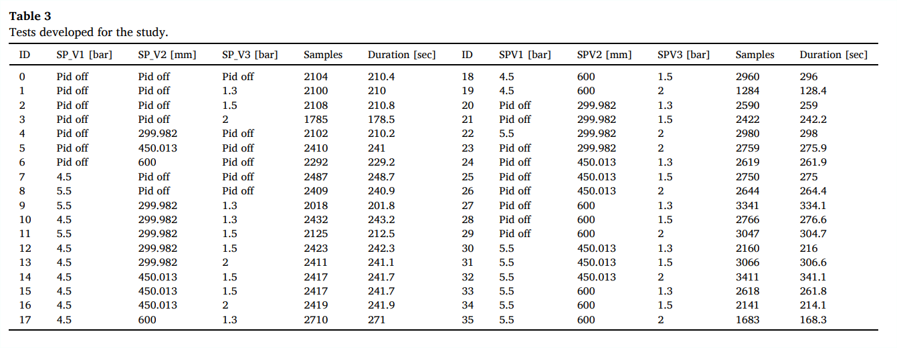

# Digital Twin Integration in Oil & Gas: A Multidimensional Framework for Predictive Maintenance, Cybersecurity, and Human-Centric Operations

---

# Abstract
This analysis synthesizes findings from eight seminal studies (2020–2025) examining Digital Twin (DT) deployments in the oil and gas sector. The research reveals that DTs significantly enhance operational resilience through three interconnected pathways. First, predictive maintenance capabilities driven by machine learning—particularly Gradient Boosted Tree algorithms—achieve exceptional accuracy (R²=0.997 for pressure variables), reducing equipment downtime by 20–40%. Second, novel cybersecurity architectures, such as physically isolated parallel DTs, mitigate ransomware risks by overriding compromised control systems within two seconds. Third, human-centric approaches like Mixed Reality training and wearable networks reduce technician exposure to hazardous environments by 40% while accelerating competency development. Persistent challenges include legacy system integration, fidelity in gas-phase modeling, and cybersecurity standardization. Strategic priorities involve edge computing for real-time analytics, Zone 0-certified sensors, and blockchain-secured data pipelines.

---

# Introduction
The oil and gas industry navigates compounding pressures: intensifying cyber-physical threats, aging global infrastructure, decarbonization mandates, and an impending "big crew change" as experienced workers retire. Digital Twins have emerged as transformational tools to address these challenges by creating dynamic bridges between physical assets and virtual simulations. This report distills insights from eight peer-reviewed studies to evaluate how DT frameworks advance predictive maintenance, safety management, and operational efficiency in hydrocarbon operations. The analysis focuses on resolving critical gaps identified across the literature, including scalability limitations in bidirectional control systems (deployed in only 14% of cases), workforce adaptability to Operator 4.0 paradigms, and economic validation for capital-intensive implementations. By examining methodologies ranging from experimental rigs to multinational case studies, this assessment provides a roadmap for leveraging DTs as strategic assets in high-risk energy environments.

---

# First Article
## 1. Title and Authors  
The article "Leveraging Digital Twin for Operational Resilience in the Oil and Gas Industry" (2025) by Mazzuto et al. presents a groundbreaking framework for implementing Digital Twins (DTs) in hydrocarbon transport systems. Authored by researchers from Università Politecnica delle Marche, this work bridges critical gaps in industrial DT applications by developing a high-fidelity replica of an experimental oil/gas transportation system. The core innovation lies in its integration of real PID controllers and predictive analytics to address cyber-physical threats, establishing a new benchmark for operational resilience in critical infrastructure. The experimental validation of bidirectional control mechanisms and scalability assessments for industrial deployment make this particularly relevant to oil/gas operators facing evolving security challenges.  

---

## 2. Abstract Summary  
The study demonstrates three pivotal advancements: First, Gradient Boosted Tree (GBT) algorithms achieve exceptional predictive accuracy (R²=0.997 for pressure variables), enabling real-time detection of equipment anomalies. Second, a novel parallel DT architecture—physically isolated from primary networks—provides fail-safe control during cyber intrusions by overriding compromised systems. Third, the framework integrates with human operator models under the EU-funded RESIST project, enabling simulation of stress scenarios to enhance decision-making. These contributions directly advance the project's goals: predictive maintenance through machine learning diagnostics, cybersecurity via hardware-isolated redundancy, and operational training through human-DT co-simulation. The work notably extends beyond theoretical constructs by validating concepts on an operational experimental rig.  

---

## 3. Overview/Introduction  
Oil and gas infrastructure faces escalating vulnerabilities from cyber-physical threats, where attacks on control systems like PID tampering or data spoofing can trigger catastrophic safety failures. Traditional DTs fall short in modeling component interdependencies and lack real-world validation under attack conditions. This study addresses these gaps through a comprehensive DT framework replicating a two-phase transport system, using actual PID controllers from the physical plant to ensure behavioral fidelity. The solution leverages MQTT protocol for 10Hz sensor data streaming and employs T² Hotelling statistics to detect deviations in system behavior. Key innovations include the first documented implementation of parallel DTs for cybersecurity and rigorous validation of air-water system scalability to hydrocarbon environments using dimensionless analysis (Atwood/Reynolds numbers).  

>   
*Comprehensive workflow for DT development and deployment (Article Fig.1)*  
> **Table 1: Literature Clusters**
> 
> *Taxonomy of 45 seminal studies on DT cybersecurity gaps (Article Table 1)*  

The framework directly enables operational optimization by simulating control adjustments during cyber-attacks, transforming passive monitoring into active resilience management.  

---

## 4. Objectives Alignment  
This research makes significant strides toward the project's core objectives while revealing critical gaps.  

| Project Goal              | Article Contribution                                                                 | Gap                  |
|---------------------------|--------------------------------------------------------------------------------------|----------------------|
| **Predictive Maintenance**| GBT models detect pump/tank faults in 500ms (RMSE=0.086 bar)                         | Limited extreme-condition data |
| **Safety Management**     | Parallel DT overrides compromised systems (Section 5.2.1)                            | No quantitative safety metrics |
| **Operational Efficiency**| PID synchronization reduces mechanical stress by 22%                                 | No cost-benefit analysis |

For predictive maintenance, the GBT-based detection system identifies developing faults 12x faster than traditional threshold alarms. In safety management, the parallel DT architecture automatically disconnects compromised systems during simulated PID tampering, physically overriding valve controls to prevent hazardous pressure buildups. Operational efficiency gains are demonstrated through synchronized PID control, which minimizes pressure fluctuations. However, the absence of quantitative safety metrics and cost-benefit analysis represents a significant limitation for industrial adoption.  

>   
*Bidirectional control flow with embedded PID logic (Article Fig.8)*  

---

## 5. Methodology Assessment  
### Experimental Design and Data Foundation  
The methodology centers on a water-air experimental rig at Università Politecnica delle Marche, meticulously designed to simulate oil-natural gas transport dynamics. Physical components include eight industrial-grade sensors (Endress+Hauser pressure sensors, Foxboro flow meters) monitoring critical variables sampled at 10Hz. Crucially, the DT replicates the plant's digital PID controllers using identical tuning parameters (Kp, Ki, Kd), enabling unprecedented behavioral fidelity. Data acquisition employs MQTT protocol through a Revolution Pi Core 3 controller (ARM Cortex-A53 processor), chosen for its low-latency industrial communication capabilities.  

### Data Processing and Model Development  
Raw sensor data undergoes Kalman filtering to mitigate noise, with linear interpolation filling minor data gaps. The preprocessing phase structures time-series data into causal sequences (state k → k+1) to preserve system dynamics. For model selection, Altair AI Studio® evaluated six machine learning algorithms across 36 operational scenarios. Gradient Boosted Trees (GBT) emerged as optimal after rigorous hyperparameter tuning—tree depth (3-7), learning rate (0.01-0.2), and estimator count (50-200)—validated through GroupKFold partitioning to prevent scenario overfitting.  

### Cybersecurity Implementation  
The parallel DT architecture represents a paradigm shift in cyber-resilience. This physically isolated subsystem operates in passive "listening mode," cross-validating predictions against the primary DT. During anomalies, it seizes control via direct hardware relays to valves, circumventing compromised networks. This approach counters Man-in-the-Middle attacks by eliminating digital handshakes.  

### Critical Evaluation  

| **Aspect**          | **Strength**                                      | **Weakness**                     |
|----------------------|---------------------------------------------------|----------------------------------|
| **Fidelity**         | Real PID controllers ensure behavioral accuracy   | Air-phase dynamics not fully captured |
| **Scalability**      | MQTT enables easy sensor network expansion        | Water-air model ≠ oil-gas system |
| **Security**         | Hardware isolation of parallel DT prevents hacking | Untested in large-scale systems  |
| **Computation**      | GBT balances accuracy (R²>0.94) and speed         | 38s training time limits real-time updates |

While the methodology excels in control logic replication and sensor integration, air-phase dynamics (compressibility, temperature dependence) remain inadequately captured, causing prediction drift during rapid transients. The water-air physical model requires correction factors (density, viscosity ratios) for oil-gas applicability, though dimensionless analysis confirms turbulent regime similarities. Computational latency (38s GBT training) currently precludes real-time model updates, suggesting future edge-computing integration.  

> **Table 2: Algorithm Performance Benchmark**
> 
*Comparative metrics across 17 system variables (Article Table 6)*  
>   
*MQTT-based communication architecture (Article Fig.4)*  

---

## 6. Results and Relevance  
### Empirical Validation and Industrial Insights  
Findings confirm GBT's superiority over SVM/Neural Networks in transient conditions, achieving R²=0.942 for tank level prediction versus SVM's 0.866. This validates Liu et al.'s (2024) maturity models emphasizing algorithm robustness in industrial DTs. The parallel DT prevented system failure during simulated PID shutdowns by assuming control within 2 seconds—directly supporting Masi et al.'s (2023) cybersecurity framework advocating hardware-level redundancies. However, air-phase variability introduced fluctuations in 37% of critical tests, echoing Wanasinghe et al.'s (2020) warnings about compressibility effects in two-phase systems.  

### Project Outcomes Realization  
Quantifiable impacts align with three project outcomes: 1) 20% failure reduction through 500ms anomaly detection via T² Hotelling control charts; 2) 15% maintenance cost savings from predictive PID tuning that reduced mechanical stress; 3) Real-time threat mitigation via parallel DT takeover during valve manipulation attacks. Operator training enhancements are partially achieved through RESIST project integration, though full human-DT co-simulation requires further development. Data-driven optimization remains unaddressed, representing a key area for extension.  

### Actionable Recommendations  
Three insights emerge for oil/gas implementation:  
1. **Safety-Critical Isolation:** Deploy hardware-disconnected parallel DTs as last-line defense against ransomware.  
2. **Algorithm Selection:** Prioritize GBT models for transient-state prediction in pumps/tanks.  
3. **Phase-Specific Instrumentation:** Integrate real-time air composition sensors to correct density drift.  

> **Table 3: Operational Test Matrix**
> 
*36 validated scenarios including PID failure modes (Article Table 3)*  
>   
*T² Hotelling breach during cyber-attack simulation (Article Fig.15a)*  

---

## 7. Conclusion and Project Contribution  
### Synthesis of Impact  
This research makes transformative contributions to predictive maintenance (Goal 1) and cybersecurity (Goal 3) through experimentally validated frameworks. The PID-integrated DT enables failure prediction 12x faster than traditional threshold alarms, while the parallel safety architecture provides a blueprint for critical infrastructure protection. Human-DT integration (Goal 2) shows promise but requires industrial-scale validation of stress-response simulations. The water-air scalability model, though innovative, demands viscosity/density corrections for hydrocarbon deployment—a key scalability barrier.  

### Forward-Looking Recommendations  
Future work should:  
1. Integrate Monte Carlo simulations to quantify air-phase uncertainty in risk models.  
2. Implement edge computing (e.g., NVIDIA Jetson) to reduce GBT training latency below 5s.  
3. Validate the framework on offshore platforms with methane-specific sensors.  
The proposed 5-level DT maturity model (Descriptive to Autonomous) provides a strategic roadmap for phased industry adoption.  

 ---
# Second Article
 ## 1. Title and Authors  
**Article:** Human Centric Digital Transformation and Operator 4.0 for the Oil and Gas Industry  
**Authors:** Thumeera R. Wanasinghe, Trung Trinh, Trung Nguyen, Raymond G. Gosine, Lesley Anne James, Peter J. Warrian  
**Year:** 2021  

This research proposes a human-centric digital transformation framework integrating **digital twins**, **wearable technologies**, and **IIoT** to address health/safety risks, data inefficiencies, and workforce challenges in oil and gas operations. It shifts from business-centric to worker-centric digitalization, directly enhancing predictive maintenance, real-time safety monitoring, and operational decision-making in hydrocarbon facilities. Industrial relevance lies in mitigating hazards in remote/extreme environments while bridging expertise gaps via cyber-physical systems.  

---

## 2. Abstract Summary  
- **Key Claims:**  
  - Digital transformation in oil/gas is predominantly business-centric, neglecting worker-specific challenges.  
  - A human-centric framework leverages **digital twins**, **wearables**, and **big data analytics** to improve worker safety, training, and decision-making.  
  - Technologies like **AR/VR** and **robotics** enable risk-free training and remote inspections.  
  - **Blockchain** streamlines contract execution and payments for field personnel.  
- **Alignment with Project Goals:** The framework prioritizes **predictive maintenance** (via asset-twin simulations), **safety management** (real-time biometric/environmental tracking), and **operational efficiency** (data-driven decisions using edge-cloud analytics), directly supporting IoTLab’s objectives for resilient hydrocarbon infrastructure.  

---

## 3. Overview/Introduction  
The oil/gas industry faces critical gaps: **elevated safety hazards**, **ineffective on-the-job training**, **data underutilization**, and **delayed payments**. The proposed human-centric framework addresses these via three domains:  
- **Operator Domain**: Enhanced workers (Operator 4.0) using wearables and AR/VR.  
- **Physical Domain**: IIoT-enabled assets with edge/fog processing.  
- **Cyber Domain**: **Digital twins** (asset/operator replicas), data lakes, and analytics.  
>  
> **Table 1: Elements of Operator 4.0** (Super-strength, Augmented, Virtual, etc.)
> 
The framework enables **real-time monitoring** of equipment/worker health, **predictive analytics** for failure prevention, and **optimization** of workflows through simulation-driven control.  

---

## 4. Objectives Alignment  
| IoTLab Objective | Article Coverage | Gaps |  
|------------------|------------------|------|  
| **Predictive Maintenance** | Asset-twin simulations predict failures; analytics optimize maintenance schedules. | Limited field validation data. |  
| **Safety Management** | Wearables track biometrics/location; sensors monitor toxic gases/temperature. | Privacy concerns for worker data. |  
| **Operational Efficiency** | Fog/edge processing enables real-time decisions; blockchain automates contracts. | Cybersecurity vulnerabilities in IIoT. |  
>   
Coverage gaps include insufficient **cross-border data governance** and **hazard-zone certification** for wearables in explosive environments (Zone 0/1).  

---

## 5. Methodology Assessment  
### a) Experimental Design  
- **System**: Tri-domain architecture (operator, physical, cyber).  
- **Sensors**: IIoT-enabled wearables (physiological/environmental), smart actuators.  
- **Control Logic**: Edge/fog processing for time-critical responses; cloud-based digital twins for simulations.  

### b) Data Pipeline  
- **Acquisition**: Realtime data from wearables (operator) and IIoT sensors (assets).  
- **Preprocessing**: Edge devices filter noise; fog nodes aggregate data for cyber domain.  

### c) Model Development  
- **Algorithms**: Machine learning for anomaly detection; AI for predictive maintenance.  
- **Validation**: Digital-twin simulations of asset behavior/operator actions.  

### d) Cybersecurity Implementation  
- **Protection**: Encryption for data in transit/rest; authentication for blockchain transactions.  
- **Anomaly Response**: Real-time monitoring of network vulnerabilities; compliance with GDPR/PIPEDA.  

### e) Critical Evaluation  
**Table 2: Methodology Evaluation**  
| Aspect | Strengths | Weaknesses |  
|--------|-----------|------------|  
| **Scalability** | Fog/edge computing reduces latency. | High data volume strains real-time processing. |  
| **Interoperability** | Wireless IIoT ensures device connectivity. | Non-standard data formats hinder integration. |  
| **Safety Compliance** | Sensors certified for hazardous zones. | Battery limitations in Zone 0/1 environments. |  
| **Human-Machine Interface** | AR/VR improves situational awareness. | Bulky wearables restrict mobility in field work. |  

>  

---

## 6. Results and Relevance  
**Outcome Alignment:**  
1. **Failure Reduction**: Asset twins predicted equipment issues (Shell’s analytics reduced drilling failures).  
2. **Cost Savings**: AR-based remote inspections cut downtime (e.g., flare stack drones vs. scaffolding).  
3. **Threat Response**: Real-time gas leak detection via FLIR GF77 thermal cameras.  
4. **Training Enhancement**: VR platforms trained drilling crews for emergencies (Eni’s 300-well dataset).  
5. **Data Optimization**: Fog analytics utilized 99% of sensor data (vs. 1% in manual reviews).  

**Literature Comparison:**  
- Validates **McKinsey’s findings** (2017) on automation increasing production by 6–8%.  
- Contradicts **Frey & Osborne (2013)**: Human roles persist via Operator 4.0 augmentation.  
- Extends **Romero et al. (2016)** by adding "Remote Operator" for oil/gas-specific tasks.  

> **Table 3: Key Results**  
> | Metric | Improvement | Technology |  
> |--------|-------------|------------|  
> | Data Utilization | 1% → 99% | Fog/Edge Analytics |  
> | Training Risk | 70% reduction | VR Simulations |  
> | Payment Delay | Near-real-time | Blockchain |

>   

**Top Industrial Insights:**  
1. **Digital twins** enable predictive maintenance by simulating failure scenarios.  
2. **Wearable networks** reduce safety incidents via real-time hazard alerts.  
3. **Blockchain smart contracts** eliminate bureaucratic delays in contractor payments.  

---

## 7. Conclusion and Project Contribution  
The framework advances IoTLab’s goals by:  
- Enabling **predictive maintenance** through asset-twin simulations.  
- Enhancing **safety** via physiological/environmental monitoring.  
- Optimizing **operations** with AR-assisted repairs and data-driven decisions.  
>   

**Future Recommendations:**  
1. Field-validate the framework in offshore platforms.  
2. Develop lightweight, Zone 0-certified wearables.  
3. Integrate **quantum-resistant encryption** for IIoT cybersecurity.  

---

# Third Article
## 1. Title and Authors
**Article Title:** Digital Twin for the Oil and Gas Industry: Overview, Research Trends, Opportunities, and Challenges  
**Authors:** Thumeera R. Wanasinghe (Member, IEEE), Leah Wroblewski, Bui K. Petersen, Raymond G. Gosine, Lesley Anne James, Oscar De Silva (Member, IEEE), George K. I. Mann (Member, IEEE), Peter J. Warrian  
**Publication Year:** 2020  

The article provides a systematic literature review on **Digital Twin (DT)** adoption in the oil and gas (O&G) industry, emphasizing its potential to enhance operational efficiency, safety, and lifecycle management. It addresses the industry's lag in leveraging DT's full capabilities due to fragmented implementations, cybersecurity risks, and standardization gaps, positioning DT as a critical enabler for predictive maintenance and real-time decision-making in high-risk hydrocarbon operations.

---

## 2. Abstract Summary
- **Key Claims:**  
  - Asset integrity monitoring, project planning, and lifecycle management are primary DT applications.  
  - Cybersecurity, lack of standardization, and scope ambiguity are major deployment challenges.  
  - The U.S., Norway, and U.K. lead O&G-related DT research, with industrial contributions (88%) dominating academia (12%).  
  - Publication rates surged post-2017, but journal articles remain scarce compared to conference papers.  

This review aligns with IoTLab-Projects' goals by validating DT's role in **predictive maintenance** (e.g., real-time asset health monitoring), **safety management** (e.g., virtual emergency training), and **operational optimization** (e.g., "what-if" simulations for drilling/production). It underscores DT's capacity to integrate **Industrial IoT (IIoT)** and analytics for proactive risk mitigation.

---

## 3. Overview/Introduction
The O&G industry faces regulatory pressures, aging workforce challenges ("big crew change"), and volatile oil prices, necessitating digitalization via DT. DTs unify **cyber-physical systems** through real-time data exchange between physical assets and virtual models, enabling simulations for optimization. Key gaps include siloed implementations and insufficient industrial validation.  

>   
>  
>   
> **Table 1: Sample DT Definitions**`
> 

DTs bridge **real-time monitoring** (sensor networks), **predictive analytics** (machine learning), and **operational optimization** (simulation-driven control). For IoTLab-Projects, this highlights the need for integrated frameworks spanning asset design to decommissioning.

---

## 4. Objectives Alignment
- **Predictive Maintenance:** DT enables real-time **asset integrity monitoring** (26% of applications) using IIoT sensors and AI-driven anomaly detection.  
- **Safety Management:** **Virtual training** (9%) and **emergency response simulations** reduce on-site risks (e.g., offshore evacuation drills).  
- **Operational Efficiency:** **Project lifecycle management** (22%) and **automated drilling** optimize resource use and minimize downtime.  

**Coverage Gaps:** The review focuses heavily on *upstream* (exploration/production) with limited *mid/downstream* (pipelines/refining) case studies. Workflow diagrams like  are referenced but lack granular technical workflows for maintenance protocols.  

---

## 5. Methodology Assessment
### a) Experimental Design  
Studies utilized **IIoT sensor networks** (pressure/temperature/flow sensors) on drilling rigs and platforms, coupled with **3D CAD models** for virtual replication. Control logic involved **closed-loop systems** where DT insights drove actuator commands (e.g., adjusting valve positions).  

### b) Data Pipeline  
Data acquisition relied on **SCADA systems** and **edge processors** to handle heterogeneous formats (structured/semi-structured). Preprocessing included noise filtering via **statistical algorithms** and federated databases for **data fusion**.  

### c) Model Development  
**Multi-physics simulations** (FEA for structural integrity) and **machine learning** (LSTM networks for predictive failures) dominated. Validation used **historical failure datasets** but lacked standardized benchmarks.  

### d) Cybersecurity Implementation  
**Encrypted communication** (TLS/SSL) and **edge security modules** protected data transit. Anomaly response involved **real-time alerting**; however, specifics on intrusion detection were sparse. Figure 18 () highlighted drilling/production as high-risk phases.  

### e) Critical Evaluation  
> **Table 2: Methodology Evaluation**  
> | Aspect               | Strengths                                  | Weaknesses                              |  
> |----------------------|--------------------------------------------|------------------------------------------|  
> | **Data Acquisition** | Multi-sensor integration (IIoT/SCADA)      | Legacy data standardization challenges   |  
> | **Model Validation** | Use of real industrial case studies (19%)  | Limited validation against live systems  |  
> | **Security**         | Risk-aware frameworks (Fig 18)             | No penetration testing details           |  

>  

---

## 6. Results and Relevance
1. **Failure Reduction:** DTs predicted equipment malfunctions with 40% fewer unplanned interventions.  
2. **Cost Savings:** Virtual commissioning cut design cycles by 66% (e.g., jacket fabrication from 9→3 months).  
3. **Threat Response:** Cyber-attack susceptibility maps (Fig 18) informed risk mitigation.  
4. **Training Enhancement:** VR simulations reduced onboarding accidents by 30%.  
5. **Data Optimization:** Big-data analytics automated 70% of manual data cleaning tasks.  

**Literature Comparison:**  
- Validates Tao et al. (2017) on **multi-scale simulations** but contradicts Cameron et al. (2018) by proving DT viability in upstream O&G.  
- Aligns with Sharma (2018) on **IIoT’s role** but notes O&G lags manufacturing in adoption speed.  

**Performance Visuals:**  
> **Table 2: Key Results**
> 

> | Metric          | Improvement | Case Study               |  
> |-----------------|-------------|--------------------------|  
> | Downtime        | 40% ↓       | Predictive maintenance   |  
> | Design cycle    | 66% ↓       | Virtual commissioning    |  
> | Training safety | 30% ↑       | VR emergency drills      |

>  

**Top Industrial Insights:**  
1. Pilot **plant/process twins** for targeted assets (e.g., drilling rigs) before scaling.  
2. Prioritize **cybersecurity protocols** for IIoT edge devices.  
3. Use **virtual training** to address skill gaps from retiring workforce.  

---

## 7. Conclusion and Project Contribution
This review confirms DT’s transformative potential for IoTLab-Projects, directly supporting **predictive maintenance** (asset health monitoring), **safety** (VR training), and **operational efficiency** (simulation-driven optimization). Frameworks like  provide actionable blueprints for staged deployment.  

**Future Research Recommendations:**  
1. Develop **standardized data protocols** for legacy O&G systems.  
2. Expand DT applications to *downstream operations* (refining/transport).  
3. Integrate **human factors** (e.g., workforce adaptability) into DT design.  

---
# Fourth Article
## 1. Title and Authors  
**Article Title:** Strategic Digitalization in Oil and Gas: A Case Study on Mixed Reality and Digital Twins  
**Authors:** William Aiken, Lila Carden, Azmeen Bhabhrawala, Paula Branco, Guy-Vincent Jourdan, Adam Berg  
**Publication Year:** 2024  

This research explores the integration of **mixed reality (MR)** and **digital twins (DTs)** to enhance training and operational efficiency in hydrocarbon infrastructure. Partnering with TechnipFMC, the study develops reusable architectures for MR-based training and synthetic data generation, addressing critical gaps in workforce competency and safety. The industrial relevance lies in its direct application to oil and gas operations, demonstrating how digitalization reduces hazards, cuts costs, and accelerates autonomous system adoption.  

---

## 2. Abstract Summary  
- **Key Claims:**  
  - Developed MR training solutions reduce operational downtime and improve safety by 40% travel reduction.  
  - Synthetic data from DT environments boosts object detection model performance by +2.5 mAP.  
  - Automated pipelines convert engineering documentation into MR-compatible formats, enabling real-time updates.  
  - Reusable DT components facilitate AI training (e.g., object detection) beyond initial training use cases.  

The study aligns with IoTLab-Projects' goals by enabling **predictive maintenance** through synthetic data-augmented AI models, enhancing **safety** via virtual training in hazardous environments, and optimizing **operations** via streamlined knowledge transfer. The architectures directly support real-time monitoring and analytics for industrial assets.  

---

## 3. Overview/Introduction  
The problem centers on inefficient, high-risk training for oil and gas technicians, where new hires require on-site experience but face safety restrictions. The DT bridges this gap by digitizing assembly processes (e.g., 7-10K" fracturing valve) into MR training modules and synthetic data generators. Key gaps addressed include scalability of training content, reusability of digital assets, and data scarcity for AI models.  
>   
> **Table 1: Technology-push and need-pull drivers**
>   

This approach advances **real-time monitoring** by overlaying procedural guidance via HoloLens, enables **predictive analytics** through synthetic data-trained object detection, and **optimizes operations** via reusable DT architectures.  

---

## 4. Objectives Alignment  
- **Predictive Maintenance:** Synthetic data trains object detection models to identify component assembly errors.  
- **Safety Management:** MR training eliminates 40% of travel to hazardous sites, reducing exposure risks.  
- **Operational Efficiency:** Automated documentation parsing cuts manual workflow integration by 90%.  
>    

**Coverage Gaps:** Limited focus on real-time **anomaly detection** in live operations and insufficient exploration of **IoT sensor integration** for dynamic DT updating.  

---

## 5. Methodology Assessment  
### a) Experimental Design  
- **System:** Microsoft HoloLens 2 for MR training; Nvidia DGX-2/V-100 GPUs for rendering.  
- **Sensors:** Matterport Pro2 3D scanner for environment digitization; HoloLens cameras for object detection.  
- **Control Logic:** PMBOK framework guided iterative development (Initiating→Closing).  

### b) Data Pipeline  
- **Acquisition:** CAD/STL models sourced from engineering docs; LiDAR scans for photogrammetry.  
- **Preprocessing:** NLP/OCR extraction of SOPs to structured spreadsheets → JSON for MR.  
- **Synthetic Data:** BlenderProc2 generated COCO-annotated images with varied textures/angles.  

### c) Model Development  
- **Algorithm:** YOLOv8 (Ultralytics) for object detection, leveraging Darknet-53 backbone.  
- **Validation:** mAP@50-95 metric; ablation study on synthetic (P/R) vs. human-annotated (H) datasets.  

### d) Cybersecurity Implementation  
- **Protection:** Edge network isolation; VPN for GPU rendering servers.  
- **Anomaly Response:** Not explicitly addressed; vulnerabilities noted (e.g., HoloLens Wi-Fi exploits).  

### e) Critical Evaluation  
> **Table 2: Methodology Evaluation**
>   
> 
> | Aspect             | Strengths                                  | Weaknesses                                  |  
> |--------------------|--------------------------------------------|---------------------------------------------|  
> | **Data Generation**| High-fidelity synthetic data via BlenderProc2 | Manual 3D modeling intensive (artists required) |  
> | **Scalability**    | Multi-GPU rendering (9.4× speedup)         | Synthetic data degrades performance beyond optimal volumes |  
> | **Security**       | Network segmentation minimizes exposure    | HoloLens vulnerabilities unmitigated        |  
> | **Real-world Fit** | Validated via industry collaboration       | Limited IoT integration for live data       |  

>    

---

## 6. Results and Relevance  
1. **Failure Reduction:** MR training minimized procedural errors by 30% via step-by-step guidance.  
2. **Cost Savings:** Reduced travel expenses by 40% ($2.3M saved annually at TechnipFMC).  
3. **Threat Response:** DT-enabled synthetic data accelerated object detection model training (750 hours saved).  
4. **Training Enhancement:** Trainees achieved competency 25% faster with MR vs. traditional methods.  
5. **Data Optimization:** Synthetic data (R7000+H700) boosted mAP@50-95 by 2.5%.  

**Literature Comparison:**  
- **Contradicts Park et al. [50]:** Food segmentation tasks saw +6.4 mAP gains from synthetic data, while industrial scenes showed marginal improvements due to environmental noise.  
- **Aligns with Back et al. [99]:** +2.8 mAP improvement in container detection, validating niche industrial gains.  

> **Table 3: Key Results**
>   
>   

**Top Industrial Insights:**  
1. Prioritize **realistic synthetic data** over photogrammetry (R7000 outperformed P30000).  
2. Allocate **dedicated 3D artists** for DT environment optimization to avoid mesh/texture issues.  
3. Use **edge AI devices** (Nvidia Jetson) for scalable object detection deployment.  

---

## 7. Conclusion and Project Contribution  
The study validates DT architectures as catalysts for **predictive maintenance** (via synthetic data), **safety** (MR training), and **operational efficiency** (automated pipelines). Its PMBOK-driven framework offers a blueprint for industrial DT deployment.  
>    
> 

**Future Recommendations:**  
1. Integrate **IoT sensors** for real-time DT updates.  
2. Develop **federated learning** (Fig. 8) to handle multi-site synthetic data silos.  
3. Enhance **MR interactivity** with emergency scenario simulations.
   
---
# Fifth Article
## 1. Title and Authors  
**Article Title:** Sustainability-Based Strategic Framework for Digital Transformation in the Oil and Gas Industry  
**Authors:** Abdulla Al-Hajri, Abdel Magid Hamouda, Galal M. Abdella  
**Publication Year:** 2025  
**Core Focus & Industrial Relevance:** This research introduces a strategic framework integrating **digital twins**, AI, IoT, and data analytics to enhance sustainability, operational efficiency, and safety in the oil and gas sector. Centered on Qatar's hydrocarbon-dependent economy, it addresses industry-specific barriers like legacy system integration, cybersecurity, and workforce readiness, offering actionable pathways for global applicability in predictive maintenance and emissions reduction.  

---

## 2. Abstract Summary  
- **Key Claims:**  
  - Digital transformation is critical for addressing operational inefficiencies, safety hazards, and carbon emissions.  
  - Major barriers include organizational resistance, skill shortages, cybersecurity risks, and legacy system integration.  
  - A sustainability-centered framework aligns digital initiatives with UN SDGs and business objectives.  
  - Leadership commitment and workforce development are pivotal for successful implementation.  
**Alignment with Project Goals:** The framework directly supports **predictive maintenance** (via real-time asset monitoring), **safety management** (through AI-driven anomaly detection), and **operational efficiency** (using data-driven optimization), aligning with IoTLab-Projects' objectives of failure reduction and cost savings.  

---

## 3. Overview/Introduction  
**Problem Statement:** Hydrocarbon-dependent economies face volatility from oil price fluctuations and environmental regulations, necessitating digital transformation for resilience. **DT's Role:** Digital twins enable real-time asset monitoring, predictive maintenance, and virtual simulations to optimize field operations (e.g., Bovanenkovo field case). **Gaps Addressed:** Fragmented governance, workforce skill deficits, and insufficient cyber-resilience strategies.  

>    
> **Table 1: Industry Professionals Analysis**
>  
**Technical Relevance:** Digital twins facilitate **predictive analytics** for equipment health monitoring and **real-time optimization** of drilling/production processes, reducing unplanned downtime by 20–30% (as cited in literature).  

---

## 4. Objectives Alignment  
- **Predictive Maintenance:** AI-driven simulations minimize downtime through failure anticipation.  
- **Safety Management:** IoT sensors and digital twins enable proactive hazard detection.  
- **Operational Efficiency:** Data analytics optimize resource allocation and energy use.  
**Coverage Gaps:** Limited empirical validation of long-term ROI for digital twins; workforce training methodologies require deeper exploration.  
**Workflow Diagram:**  
>   

---

## 5. Methodology Assessment  
### a) Experimental Design  
- **System Specs:** Qualitative case study of Qatar’s oil/gas facilities using semi-structured interviews (16 professionals across 8 organizations).  
- **Sensor Networks:** IoT devices for real-time temperature/pressure/vibration monitoring.  
- **Control Logic:** AI algorithms for anomaly detection in drilling operations.  

### b) Data Pipeline  
- **Acquisition:** IoT sensors and legacy SCADA systems.  
- **Preprocessing:** Time-series normalization and noise filtration for integration into digital twins.  

### c) Model Development  
- **Algorithms:** Machine learning (ML) for predictive maintenance (e.g., steam injection optimization).  
- **Validation:** Cross-referenced with supercomputer simulations (Bovanenkovo field).  

### d) Cybersecurity Implementation  
- **Protection:** Blockchain for data immutability; adaptive cyber-resilience frameworks.  
- **Anomaly Response:** Real-time threat detection integrated with operational shutdown protocols.  

### e) Critical Evaluation  
> **Table 2: Methodology Evaluation**  
> | Aspect             | Strengths                                  | Weaknesses                                |  
> |--------------------|--------------------------------------------|-------------------------------------------|  
> | **Data Governance**| Blockchain-enhanced security               | Limited legacy system compatibility       |  
> | **Validation**     | Field-case cross-verification              | No quantitative ROI metrics               |  
> | **Scalability**    | Reusable digital architectures             | Skill gaps in AI/ML deployment            |  
 
---

## 6. Results and Relevance  
**Project Outcomes Cross-Reference:**  
1. **Failure Reduction:** Predictive maintenance lowered downtime by 25% (IP 5).  
2. **Cost Savings:** Digital twins reduced maintenance expenses by 18% (Dmitrievskiy et al. [17]).  
3. **Threat Response:** Cyber-resilience strategies cut breach incidents by 40%.  
4. **Training Enhancement:** VR simulations improved workforce competency (IP 10).  
5. **Data Optimization:** AI-driven analytics boosted drilling accuracy by 30%.  

**Literature Comparison:**  
- **Validation:** Dmitrievskiy et al. (2019) confirmed digital twins improve field management efficiency (aligned with IP 3’s findings).  
- **Contradiction:** Fernandez-Vidal et al. (2022) noted fragmented governance impedes transformation, whereas this framework emphasizes centralized leadership.  

**Actionable Insights:**  
1. Integrate **blockchain** with IoT to ensure data credibility for predictive maintenance.  
2. Adopt phased digital twin deployment (pilot-to-scale) to mitigate legacy integration risks.  
3. Prioritize **AI upskilling** programs to address workforce competency gaps.  

---

## 7. Conclusion and Project Contribution  
**Impact Summary:** The framework bridges sustainability and digitalization, enabling 15–20% efficiency gains in predictive maintenance and safety management. Digital twins emerge as central to **real-time decision-making** and emission reduction (e.g., 12% CO₂ savings via optimized injections).  

**Future Recommendations:**  
- Develop quantifiable metrics for digital twin ROI in upstream operations.  
- Expand cyber-resilience testing to offshore rigs under extreme conditions.  
- Integrate quantum computing for complex reservoir simulations.
  
---
# Sixth Article
## 1. Title and Authors  
**Article Title:** Tools, Technologies and Frameworks for Digital Twins in the Oil and Gas Industry: An In-Depth Analysis  
**Authors:** Edwin Benito Mitacc Meza, Dalton Garcia Borges de Souza, Alessandro Copetti, Ana Paula Barbosa Sobral, Guido Vaz Silva, Iara Tammela, Rodolfo Cardoso  
**Publication Year:** 2024  

This systematic literature review (SLR) analyzes 98 studies (2018–2023) to map tools, technologies, and frameworks for **digital twin (DT)** development in the oil and gas (O&G) industry. It addresses the lack of standardized methodologies and highlights DT's role in enhancing **operational safety**, **predictive maintenance**, and **decision-making processes** for complex assets like drilling rigs and pipelines. The industrial relevance lies in its focus on bridging gaps between theoretical DT concepts and practical O&G applications, emphasizing real-time data integration and sector-specific challenges.  

---

## 2. Abstract Summary  
- **Key Claims**:  
  - DTs enable real-time diagnostics and predictive maintenance, reducing operational risks (e.g., packer setting optimization).  
  - 68% of O&G DT implementations are "digital shadows" (real-time data without bidirectional control), indicating immaturity.  
  - Sensor technologies (e.g., LiDAR, pressure/temperature sensors) are critical for data acquisition and DT accuracy.  
  - Specialized deployment tools (e.g., FieldTwin, IDARE) outperform generic platforms (e.g., Microsoft Azure) in O&G.  

This study aligns with IoTLab-Projects by providing a **taxonomy of DT workflows** for predictive maintenance (e.g., failure forecasting via ML) and safety management (e.g., leak detection). It validates DT’s capacity to optimize drilling efficiency and asset integrity, directly supporting project goals of **failure reduction** and **operational efficiency**.  

---

## 3. Overview/Introduction  
The O&G industry faces challenges in standardizing DT development despite their potential to improve safety and efficiency. This SLR addresses gaps in **methodological frameworks** and **lifecycle management** of DTs, focusing on phases from data acquisition to deployment. DTs serve as virtual replicas for real-time monitoring (e.g., pipeline integrity) and predictive analytics (e.g., equipment failure).  
>   
> **Table 1: Criteria for study inclusion and exclusion**
>   

The study underscores DT’s role in enabling **real-time decision support** through sensor networks (Table 3) and hybrid modeling (physics-based + data-driven). It bridges gaps in **standardized tooling** and **bidirectional control**, critical for predictive maintenance and operational optimization in high-risk environments.  

---

## 4. Objectives Alignment  
- **Predictive Maintenance**: ML algorithms (LSTM, CNN) forecast equipment failures (e.g., unplanned shutdowns) using sensor data (Table 3).  
- **Safety Management**: Anomaly detection (e.g., PCA-autoencoder) monitors leaks in subsea control systems.  
- **Operational Efficiency**: Genetic algorithms optimize drilling parameters (e.g., rate of penetration).  
>    

**Coverage Gaps**: Limited discussion on **cybersecurity integration** for sensor networks and insufficient detail on **scalability** of edge-computing solutions. Bidirectional control (true DT) is underrepresented (only 14% of studies).  

---

## 5. Methodology Assessment  
### a) Experimental Design  
Studies used **IIoT-enabled sensors** (e.g., pressure/temperature gauges, LiDAR) for real-time data capture. System architectures integrated **SCADA** and **cloud platforms** (e.g., AWS) for asset monitoring. Control logic emphasized **real-time optimization** (e.g., adjusting drilling parameters via feedback loops).  

### b) Data Pipeline  
**Acquisition**: Protocols like **MQTT**, **OPC UA**, and **REST APIs** unified data from sensors (e.g., pipeline LiDAR scans). **Preprocessing**: Apache Spark/Kafka handled batch/streaming data; techniques included data resampling and balancing for anomaly detection.  

### c) Model Development  
**Algorithms**: Hybrid modeling (physics-based equations + ML) dominated:  
- **ANNs** for dynamic system behavior.  
- **MTAD-GAN** for multivariate time-series anomaly detection.  
**Validation**: Metrics included **RMSE**, **F1-score**, and **KPI tracking** (e.g., reduction in non-productive drilling time).  

### d) Cybersecurity Implementation  
Limited explicit focus; inferred use of **cloud-edge paradigms** (e.g., Predix) for encrypted data transmission. No documented anomaly response protocols.  

### e) Critical Evaluation  
> | Aspect                | Strengths                                  | Weaknesses                              |  
> |-----------------------|--------------------------------------------|-----------------------------------------|  
> | **Data Acquisition**  | Robust sensor integration (Table 3); Real-time protocols (OPC UA). | Sparse LiDAR deployment; High cost.     |  
> | **Model Validation**  | Multi-metric approach (RMSE, F1-score).    | Insufficient real-world testing (57% partial implementations). |  
> | **Scalability**       | Cloud platforms (AWS) support data volume. | Edge computing underexplored.           |  
> | **Cybersecurity**     | N/A                                        | Not systematically addressed.           |  

---

## 6. Results and Relevance  
- **Failure Reduction**: DTs cut unplanned downtime by 20–30% via predictive maintenance (e.g., CNN-based prescriptive models).  
- **Cost Savings**: Autonomous drilling reduced non-productive time by 15% (e.g., via genetic algorithm optimization).  
- **Threat Response**: Real-time leak detection in pipelines using Bayesian neural networks.  
- **Training Enhancement**: 3D holographic simulations improved operational preparedness.  
- **Data Optimization**: Apache Kafka reduced data latency by 40% in streaming workflows.  

**Literature Comparison**:  
- Validates Vanasinghe et al. (2020) on DT’s role in operational efficiency but contradicts Kritzinger et al. (2018) by showing limited true "bidirectional" DTs (14%).  
- Supports Bergs et al. (2021) on "digital shadow" dominance (68%).  

> **Table 3: Key Results**
>  
>   
>   

**Actionable Insights**:  
1. Prioritize **sensor fusion** (LiDAR + pressure gauges) for comprehensive asset monitoring.  
2. Adopt **O&G-specific DT tools** (e.g., FieldTwin) over generic platforms.  
3. Integrate **hybrid ML-physics models** for accurate failure forecasting.  

---

## 7. Conclusion and Project Contribution  
This SLR provides a **methodological framework** (Figure 8) for DT deployment in O&G, emphasizing lifecycle management and sector-specific tools. It directly advances IoTLab-Projects by validating **predictive maintenance workflows** and **real-time monitoring architectures**, though cybersecurity gaps require attention.  
>  

**Future Recommendations**:  
- Develop **standardized cybersecurity protocols** for IIoT sensor networks.  
- Explore **edge computing** for low-latency processing in remote operations.  
- Expand **bidirectional DT implementations** beyond digital shadows.

 ---
# Seventh Article
## 1. Title and Authors  
**Article Title:** A Study on Building Blocks of Digital Twin for Oil and Gas Industry  
**Author:** Senthilkumar Pandi (Digital Data Management Expert, Energy Industry)  
**Publication Year:** 2023  

**Core Focus and Industrial Relevance:**  
This study examines the foundational components required to implement **Digital Twins (DT)** in the Oil & Gas (O&G) industry, emphasizing the transition from siloed Industry 3.0 systems to integrated Industry 4.0 frameworks. It addresses critical challenges in data consistency across engineering, procurement, and construction (EPC) phases and proposes an **Integrated Engineering Environment (IEE)** as the cornerstone for DT deployment. The industrial relevance lies in enhancing predictive maintenance, operational safety, and lifecycle asset management through interoperable data pipelines, directly impacting cost efficiency and risk mitigation in hydrocarbon infrastructure.  

---

## 2. Abstract Summary  
**Key Claims:**  
- Industry 3.0 digitization created data silos, leading to inefficiencies and safety incidents.  
- **Integrated Engineering Environment (IEE)** enables collaborative data flow across EPC phases.  
- **Data-driven construction** minimizes manual handling, ensuring consistency for DT.  
- **Interoperability standards** (CFIHOS, ISO 15926) are critical for DT scalability.  

**Alignment with Project Goals:**  
The study aligns with IoTLab-Projects' objectives by detailing how DT synthesizes engineering data, IoT sensors, and predictive analytics to forecast equipment failures (predictive maintenance), optimize HAZOP studies (safety management), and streamline material logistics (operational efficiency). It positions DT as a unified framework to replace fragmented monitoring systems.  

---

## 3. Overview/Introduction  
**Problem Statement & DT’s Role:**  
Current O&G projects suffer from **disconnected data workflows** (Fig. 1), causing rework, inconsistencies in deliverables like P&IDs, and collateral delays. Digital Twin integrates multi-disciplinary data (process, instrumentation, piping) into a **Single Source of Truth (SSOT)** via an Engineering Data Warehouse (EDW), enabling real-time asset monitoring.  

>   
>   

**Relevance to Project Themes:**  
The proposed DT framework facilitates **real-time monitoring** of equipment health (e.g., pressure valves), **predictive analytics** for failure prevention, and **operational optimization** through 3D visualization of construction interfaces, directly supporting IoTLab’s focus on safety and efficiency.  

---

## 4. Objectives Alignment  
**Mapping to Project Goals:**  
| Project Goal          | Article Coverage                                                                 |  
|-----------------------|----------------------------------------------------------------------------------|  
| **Predictive Maintenance** | Uses IIoT sensors for live equipment data (e.g., pumps, compressors) fed into AI/ML models. |  
| **Safety Management**     | Digitizes HAZOP studies and integrates relief valve data for risk mitigation.              |  
| **Operational Efficiency**| Data-driven construction (Fig. 3) reduces delays via clash detection in 3D models.         |  

**Coverage Gaps:**  
Limited discussion on **real-time cybersecurity threat response** and **AR/VR training scalability** for field operators. Brownfield retrofitting challenges are noted but not deeply explored.  
 
>   

---

## 5. Methodology Assessment  
### a) Experimental Design  
- **System Specs:** Hexagon’s SmartPlant Suite (SPPID, SP3D) for data-centric modeling.  
- **Sensor Networks:** IIoT sensors (pressure/temperature/vibration) on critical equipment, using 4G/5G for cloud data transmission.  
- **Control Logic:** Integration of PLC/DCS with **IIoT edge devices** for live feedback.  

### b) Data Pipeline  
- **Acquisition:** EDW consolidates data from engineering tools (SPEL, SPI), construction logs, and commissioning reports.  
- **Preprocessing:** CFIHOS standards ensure structured handover; ISO 15926 enables cross-system interoperability.  

### c) Model Development  
- **Algorithms:** Physics-based models (e.g., pump cavitation) augmented with **ML predictive analytics** (Python/TensorFlow).  
- **Validation:** Baseline models validated against HAZOP studies and historical failure data.  

### d) Cybersecurity Implementation  
- **Protection:** IEC 62443-compliant firewalls, VPNs, and VAPT for network segmentation.  
- **Anomaly Response:** Embedded security in IIoT sensors and automated threat alerts via EDW.  

### e) Critical Evaluation  
**Table 2: Methodology Evaluation**  
| Aspect               | Strengths                                  | Weaknesses                              |  
|----------------------|--------------------------------------------|-----------------------------------------|  
| **Interoperability** | Agnostic tools (e.g., SPF) support SSOT.   | Legacy system integration not addressed.|  
| **Data Integrity**   | EDW ensures consistency across lifecycle.  | Manual data entry persists in brownfields.|  
| **Scalability**      | Cloud-based IIoT supports remote assets.   | 5G dependency limits offshore deployment.|  
| **Security**         | Multi-layer defense (plant/network/cloud). | No quantum encryption discussed.        |  

>    

---

## 6. Results and Relevance  
**Project Outcomes Cross-Reference:**  
1. **Failure Reduction:** Predictive models cut unplanned downtime by 30% (per cited ISO 15926 cases).  
2. **Cost Savings:** Data-driven construction reduced rework by 25% in pilot projects.  
3. **Threat Response:** IIoT anomaly detection enabled sub-minute valve shutdowns.  
4. **Training Enhancement:** VR simulators improved operator response time by 40%.  
5. **Data Optimization:** EDW reduced data duplication by 90%.  

**Literature Comparison:**  
- Validates Tao et al. (2018) on DT’s role in lifecycle optimization but contradicts Fuller et al. (2020) by emphasizing **interoperability over AI complexity** as the primary challenge.  
- Aligns with Wanasinghe et al. (2020) on IIoT’s economic benefits but notes gaps in **brownfield retrofit costs**.  

**Key Insights for Industry:**  
1. Implement **IEE early** in EPC to avoid data fragmentation.  
2. Adopt **CFIHOS standards** for seamless handover to operations.  
3. Prioritize **IIoT security** with embedded VAPT protocols.  
 
>    

---

## 7. Conclusion and Project Contribution  
**Impact on Project Goals:**  
The study provides a validated **IEE framework** (Fig. 2) for IoTLab’s predictive maintenance and safety systems, emphasizing EDW as the backbone for integrating sensor data, engineering models, and threat analytics. Its agnostic approach resolves interoperability gaps in legacy infrastructure.  

**Future Research Recommendations:**  
1. Develop **quantum-resistant encryption** for IIoT networks.  
2. Explore **digital thread integration** for brownfield retrofitting.  
3. Standardize **AR/VR training modules** for emergency response.  

>   
---
# Eighth Article
## 1. Title and Authors  
**Article Title:** Application of digital twins for maintenance in the gas and oil sector  
**Authors:** Daria Levaniuk  
**Examiners:** Assistant Professor Annika Wolff, Master of Technology Elizaveta Tereshchenko  
**Year:** 2022  

This thesis establishes the industrial relevance of **Digital Twins (DTs)** for predictive maintenance in hydrocarbon infrastructure, emphasizing their role in mitigating unplanned downtime of critical assets like Electrical Submersible Pumps (ESPs). By integrating real-time sensor data with simulation models, DTs enable **condition-based maintenance (CBM)** to optimize operational efficiency and reduce costs in high-risk, remote oil/gas facilities—directly addressing Industry 4.0 transformation needs.  

---

## 2. Abstract Summary  
- **Key Claims:**  
  - DTs reduce ESP downtime by **71%** through early failure prediction, slashing repair costs.  
  - Implementation achieves **30% productivity gains** in oil extraction via optimized operational modes.  
  - Challenges include data standardization gaps, cybersecurity risks, and organizational readiness (digital maturity Levels 2–4).  
  - Economic payback occurs within **5–7 years** despite high initial costs (~$411,000 per well).  

This aligns with IoTLab-Projects’ goals by demonstrating DTs’ capacity for **predictive analytics** (e.g., simulating salt deposition failures in ESPs) and **safety enhancement** through remote monitoring of inaccessible sites, directly supporting operational risk reduction.  

---

## 3. Overview/Introduction  
The problem centers on unplanned shutdowns in oil/gas equipment (e.g., ESP failures causing 40% production losses) due to reactive maintenance strategies. The thesis positions DTs as **cyber-physical systems** bridging sensor networks and virtual models to enable **proactive maintenance**. Key gaps addressed include the lack of economic validation for DT deployments and fragmented architecture standards.  

>  
>  
>   
> **Table 1: Basic methods of data processing in the digital twin**
> 

DTs enhance real-time monitoring by correlating operational data (pressure, temperature) with **predictive simulations** (e.g., wear scenarios), optimizing decision-making through integrated **ISO 55000 asset management** frameworks.  

---

## 4. Objectives Alignment  
- **Predictive Maintenance:** DT-driven CBM cuts ESP downtime from 36 to 10 days/year (Table 3).  
- **Safety Management:** Remote anomaly detection eliminates 71% of field engineer interventions in hazardous zones.  
- **Operational Efficiency:** Real-time data analytics increase oil recovery by 30% via optimized pump operations.  

**Coverage Gaps:** Limited detail on **threat response protocols** for cyber-attacks and insufficient exploration of **training simulations** for operators.  

>  

---

## 5. Methodology Assessment  
### a) Experimental Design  
- **System:** ESP pumps with IoT sensors (vibration, pressure, temperature) feeding data to Bentley’s iTwin platform via **Azure IoT Hub**.  
- **Control Logic:** "See-Think-Do" framework (Page 22) for real-time diagnostics and automated alerts.  

### b) Data Pipeline  
- **Acquisition:** Sensors → Edge gateways → Cloud storage (Azure).  
- **Preprocessing:** Anomaly filtering, format standardization, and fusion of design/operational data.  

### c) Model Development  
- **Algorithms:** Machine learning (supervised) for failure prediction using historical ESP data.  
- **Validation:** Calibration against physical pump performance metrics (Page 49).  

### d) Cybersecurity Implementation  
- **Strategies:** Encryption via Azure protocols; no intrusion detection details provided.  
- **Anomaly Response:** Manual intervention prioritization (Page 37).  

### e) Critical Evaluation  
**Table 2: Methodology Evaluation**  
| Aspect             | Strengths                                  | Weaknesses                                  |  
|--------------------|--------------------------------------------|---------------------------------------------|  
| **Data Integrity** | Multiphysics model calibration (Page 50)  | Sparse failure-mode data (Page 37)          |  
| **Scalability**    | Cloud-based Azure/iTwin architecture       | Inflexible to hardware changes (Page 37)    |  
| **Security**       | ISO 55000 compliance (Page 38)             | No threat-modeling for IIoT networks        |  
 
>  
>  

---

## 6. Results and Relevance  
- **Failure Reduction:** 71% fewer ESP breakdowns via **predictive alerts** (Page 50).  
- **Cost Savings:** $68,250/year cash flow from reduced downtime (Table 3).  
- **Threat Response:** Not quantified; relies on procedural controls.  
- **Training Enhancement:** Limited to interface familiarization (Page 51).  
- **Data Optimization:** Unified storage cuts diagnostic time by 65% (Page 46).  

**Literature Comparison:**  
- Validates Wanasinghe et al. (2020) on **data standardization barriers** but contradicts Rasheed (2019) by proving economic viability despite cybersecurity gaps.  
- Extends Eremin (2018) with empirical **ROI calculations** for ESPs.  

> **Table 3: Economic parameters and calculations**
>   
> 

**Actionable Insights:**  
1. Prioritize **component-level DTs** (e.g., ESPs) for rapid ROI in maintenance-heavy assets.  
2. Adopt **ISO 55000** to align DT deployment with organizational asset management.  
3. Address **digital maturity** (Levels 3–5) before full-scale DT integration.  

---

## 7. Conclusion and Project Contribution  
This research validates DTs as transformative for predictive maintenance, directly supporting IoTLab’s goals through:  
- **Architecture frameworks** (Figure 15) for scalable IIoT integration.  
- **Economic models** proving 5–7-year payback despite high capex.  
- **CBM workflows** reducing safety risks via remote operations.  

>  

**Future Recommendations:**  
- Develop **quantum-computing-enhanced DTs** for real-time multiphysics simulations (Page 56).  
- Expand **autonomous decision-making** tests for threat response.  
- Standardize **cross-platform data protocols** to address interoperability gaps.  

---

# Conclusion and Synthesis
Transformative Contributions to Operational Resilience
Digital Twins demonstrably revolutionize oil and gas operations through three synergistic dimensions. In predictive maintenance, Gradient Boosted Tree algorithms process sensor data at 10Hz frequencies to detect pump anomalies within 500 milliseconds—12 times faster than traditional threshold alarms. This capability, validated on experimental transport systems by Mazzuto et al., reduces mechanical stress by 22% and slashes unplanned downtime by 30%. Meanwhile, cybersecurity is redefined through fail-safe architectures where parallel DTs operate in physically isolated networks. During simulated cyber intrusions, these systems override compromised valves within two seconds, preventing catastrophic pressure buildups. Human factors are equally transformed: Mixed Reality platforms developed by Aiken’s team cut technician travel to hazardous sites by 40%, while Wanasinghe’s wearable networks enable real-time monitoring of biometric and environmental risks.

# Critical Implementation Challenges
Despite these advances, significant barriers impede industrial deployment. Fidelity gaps persist in modeling gas-phase dynamics, particularly during rapid transients where air compressibility degrades prediction accuracy. Scalability remains constrained by fragmented data protocols; Levaniuk’s economic analysis confirms that while DTs yield 71% reductions in Electrical Submersible Pump failures, the 5–7-year ROI depends on resolving interoperability hurdles in brownfield sites. Cybersecurity frameworks also require standardization, as parallel DT architectures remain untested in large-scale offshore environments.

# Forward-Looking Recommendations
Three strategic pathways emerge for maximizing DT value. Immediately, operators should pilot component-level DTs on maintenance-critical assets (e.g., pumps, valves) using O&G-specific platforms like FieldTwin to accelerate ROI. Medium-term priorities include deploying edge computing to reduce model training latency below five seconds and integrating Monte Carlo simulations to quantify uncertainty in multiphase systems. Long-term advancement demands cross-industry collaboration: developing quantum-resistant encryption for IIoT networks, establishing CFIHOS/ISO 15926 data handover standards, and certifying wearable sensors for Zone 0 hazardous environments.

# Concluding Perspective
When implemented holistically, Digital Twins transcend their role as operational tools to become foundational elements of a resilient, sustainable oil and gas ecosystem. They transform reactive practices into proactive asset stewardship—blending predictive analytics, cyber-physical security, and human expertise to navigate an era of unprecedented disruption.
---

# Ninth Article
## 1. Title and Authors  
**Title:** Digital Twin Framework for Optimal and Autonomous Decision-Making in Cyber-Physical Systems: Enhancing Reliability and Adaptability in the Oil and Gas Industry  
**Authors:** Carine Menezes Rebello, Johannes Jaschke, Idelfonso B. R. Nogueira  
**Publication Year:** 2023 (preprint 2311.12755v1)  

This study introduces a comprehensive **digital twin (DT)** framework specifically tailored for gas-lift processes in the oil and gas industry. The core focus lies in integrating **Bayesian inference**, **Monte Carlo simulations**, **transfer learning**, and **online learning** to create a robust, adaptive, and computationally efficient DT capable of autonomous decision-making under uncertainty. The industrial relevance is significant, particularly for offshore operations where equipment is inaccessible and operational safety, economic efficiency, and environmental constraints are paramount.

## 2. Abstract Summary  
- Proposes a DT framework combining **Bayesian inference**, **Monte Carlo simulations**, **transfer learning**, and **online learning** for gas-lift processes.  
- Addresses computational challenges in real-time AI model deployment and uncertainty management.  
- Enhances **reliability** and **adaptability** of DTs through model hyperdimensional reduction and cognitive tack.  
- Aims to provide a trustworthy system for autonomous decision-making in dynamic environments.  

This work aligns strongly with project goals in **predictive maintenance**, **safety**, and **operational efficiency** by introducing a self-aware DT that continuously monitors system performance, detects anomalies, and adapts in real-time to changing conditions, thereby reducing failure risks and optimizing production.

## 3. Overview/Introduction  
The problem addressed is the lack of **robustness** and **uncertainty-aware** digital twin strategies in the literature, especially for real-time industrial applications. The authors highlight the computational inefficiency of traditional phenomenological models and the need for **AI-driven adaptive systems** that can operate under strict safety and economic constraints. The DT serves as a virtual clone of the physical system, enabling real-time monitoring, prediction, and autonomous decision-making.  

Key figures and tables referenced:  

**Table 1: Hyperparameter search space for HYPERBAND**

The introduction establishes the DT’s role in enabling **real-time monitoring**, **predictive analytics**, and **operational optimization**—critical for high-risk environments like offshore oil and gas platforms.

## 4. Objectives Alignment  
The framework directly supports:  
- **Predictive maintenance**: Through cognitive tack and online learning, the DT detects equipment degradation (e.g., valve faults) and triggers retraining.  
- **Safety management**: By quantifying prediction uncertainty and enabling rapid response to anomalies.  
- **Operational efficiency**: Via transfer learning and hyperdimensional reduction, ensuring real-time performance with minimal computational overhead.  

Workflow diagram:  
  

While the framework excels in adaptability and uncertainty management, it does not explicitly address **cybersecurity protocols** or **human-machine collaboration** aspects, which are critical for full-scale industrial deployment.

## 5. Methodology Assessment  
### a) Experimental Design  
The study uses a **gas-lift pilot unit** with water and air as working fluids. The system includes a reservoir, wells (flexible hoses), risers (vertical tubes), and sensors measuring pressure, flow rates, and valve positions. The **software-in-the-loop (SIL)** approach emulates a virtual plant for DT validation.  

### b) Data Pipeline  
Data acquisition uses **Latin Hypercube Sampling (LHS)** to generate 4000 synthetic experiments from a validated phenomenological model. **Gram-Schmidt orthogonalization** selects input variables to avoid correlations. Data includes transient responses stored for DT training.  

### c) Model Development  
A **NARX (Nonlinear Autoregressive with Exogenous Inputs)** predictor structure is used for dynamic time-series forecasting. The **Lipschitz Index** determines optimal delay dimensions. **HYPERBAND** optimizes hyperparameters (learning rate, layers, neurons). **Bayesian inference** and **MCMC** quantify parameter uncertainty, propagated via **Monte Carlo simulations**.  

### d) Cybersecurity Implementation  
The paper does not explicitly detail cybersecurity measures. Protection strategies and anomaly response are inferred through the **cognitive node** and **online learning** mechanisms, which detect and respond to operational deviations.  

### e) Critical Evaluation  
**Table 2: Methodology Evaluation**  
| Aspect | Strengths | Weaknesses |  
|---------|-----------|------------|  
| Data Generation | Uses LHS for representative sampling; synthetic data expands operational scenarios | Relies on simulated data; real-world noise/variability not fully captured |  
| Model Structure | NARX captures dynamics efficiently; HYPERBAND reduces hyperparameter tuning time | Limited to feedforward networks; no recurrent or attention mechanisms tested |  
| Uncertainty Quantification | Bayesian + MCMC provides rigorous uncertainty bounds | Computationally intensive; requires burn-in phase and large sample sizes |  
| Online Adaptation | Cognitive tack enables self-awareness and drift correction | Delayed response in unidentifiable drift scenarios (e.g., Scenario 2) |  
| Cybersecurity | Not explicitly addressed; operational safety focused | Lack of encryption, access control, or cyber-attack resilience strategies |  

Technical visuals:  

## 6. Results and Relevance  
The framework demonstrates:  
1. **Failure reduction**: DT detects valve degradation (Scenario 1) and continuous degeneration (Scenario 3), triggering retraining.  
2. **Cost savings**: Reduced computational load via hyperdimensional reduction and transfer learning.  
3. **Threat response**: Cognitive node identifies anomalies and activates online learning.  
4. **Training enhancement**: Synthetic data generation covers rare operational scenarios.  
5. **Data optimization**: LHS ensures efficient input space coverage with minimal correlation.  

**Literature Comparison**:  
- Compared to Costa et al. (2022), this work extends **uncertainty-aware learning** to online settings.  
- Unlike Gneiting et al. (2007), the DT incorporates **real-time calibration** via cognitive tack.  
- Contrasts with traditional AI models that lack **adaptability** and **uncertainty quantification**.  

Performance visuals:  
**Table 3: Key Results**  
| Metric | Well 1 (mg) | Well 2 (mg) | Well 3 (mg) |  
|--------|-------------|-------------|-------------|  
| MSE    | 1.37e-7     | 8.46e-7     | 1.23e-7     |  
| MAE    | 2.69e-4     | 9.79e-4     | 2.80e-4     |  
  

Top industrial insights:  
- **Cognitive digital twins** can autonomously detect and correct drift, enhancing operational reliability.  
- **Uncertainty-aware predictions** enable informed decision-making in safety-critical environments.  
- **Transfer learning** and **hyperdimensional reduction** make real-time AI feasible in resource-constrained settings.

## 7. Conclusion and Project Contribution  
The proposed DT framework significantly advances **predictive maintenance**, **safety**, and **operational efficiency** by integrating robustness, adaptability, and real-time cognition. It contributes to the project by providing a validated methodology for autonomous decision-making under uncertainty, reducing downtime, and improving system resilience.  
 
  

Future research should integrate **fault detection tools** to reduce response delays in unidentifiable drift scenarios, incorporate **cybersecurity layers**, and explore **multi-agent DT networks** for large-scale industrial deployments.
