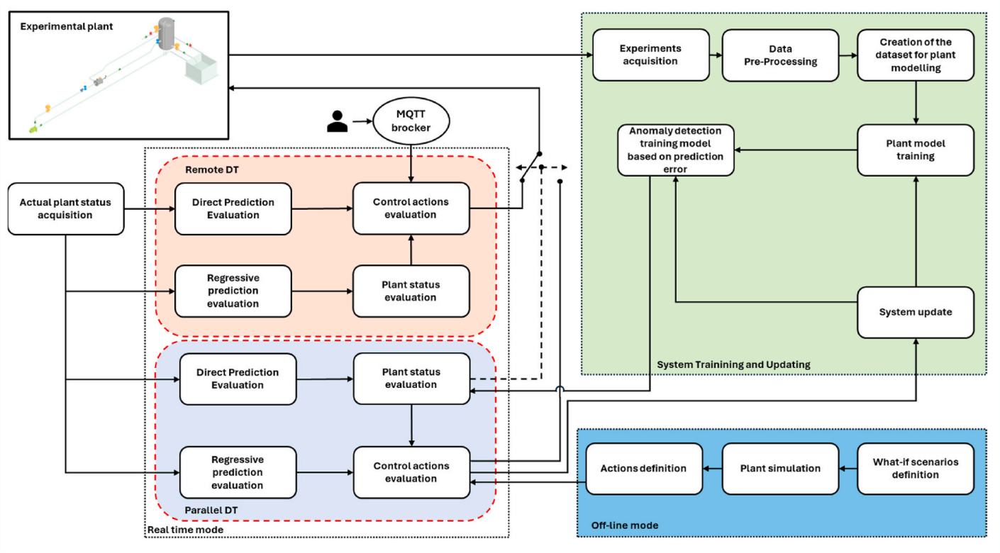
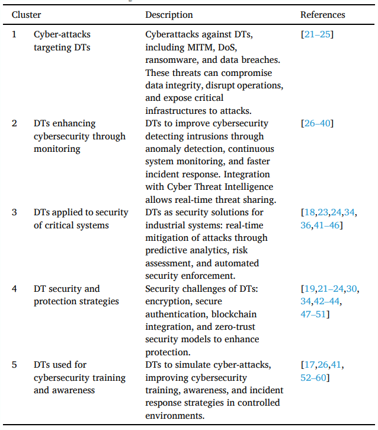
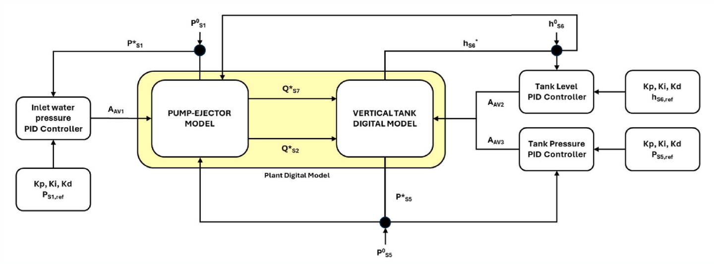
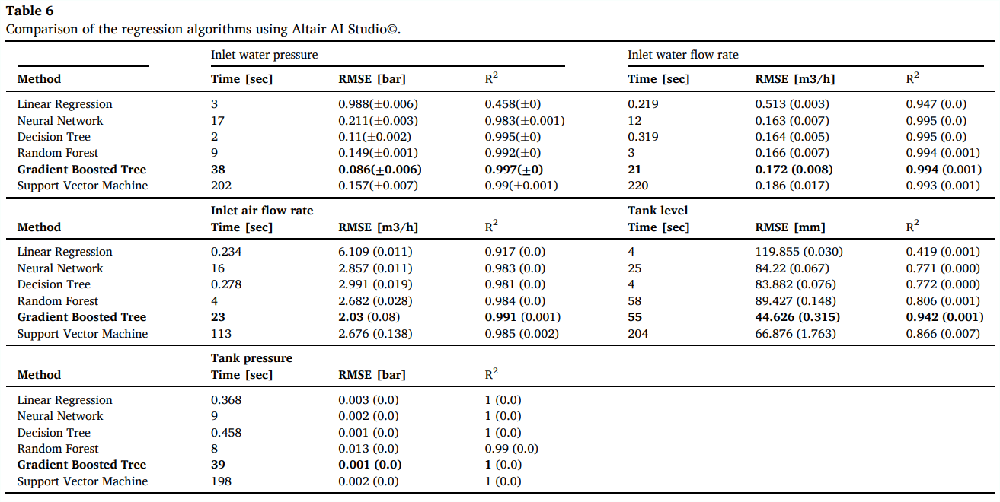
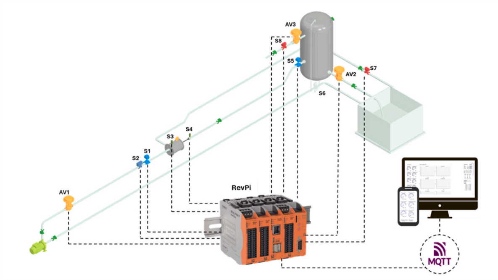
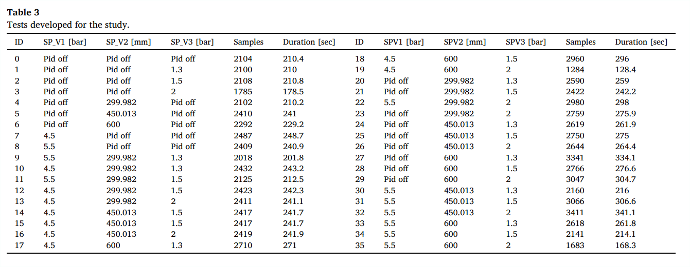

## 1. First Article

**Article:** Leveraging Digital Twin for Operational Resilience in the Oil and Gas Industry  
**Authors:** Giovanni Mazzuto, Ilaria Pietrangeli, Marco Ortenzi, Filippo Emanuele Ciarapica, Maurizio Bevilacqua  
**Year:** 2025  
**Core Focus:** Development of a DT framework integrating PID controllers and predictive analytics to enhance anomaly detection and cybersecurity resilience in oil/gas transport systems. _Relevance lies in its experimental validation of bidirectional DT control and parallel security architectures for critical infrastructure._

---

## 2. Abstract Summary

- **Predictive Anomaly Detection:** Gradient Boosted Tree (GBT) algorithms achieve R²=0.997 for inlet pressure prediction, enabling real-time fault identification.
- **Cybersecurity Integration:** Parallel DT architecture physically isolated from networks acts as a "safety switch" during cyber intrusions.
- **Human-DT Integration:** Part of EU-funded RESIST project, combining plant DT with operator DT for stress scenario simulation.  
  _Alignment: Directly addresses practical implementation of predictive maintenance (Goal 1) and cybersecurity (Goal 3), while exploratory human-DT integration extends to adaptive training (Goal 2)._

---

## 3. Overview/Introduction

**Problem Statement:** Oil/gas systems face cyber-physical threats (e.g., PID tampering, data spoofing) with cascading safety risks. Existing DTs lack comprehensive component interdependency modeling.  
**DT Role:** High-fidelity replica of experimental transport system using real PID controllers, enabling:

- Real-time monitoring via MQTT protocol
- Anomaly detection via T² Hotelling statistics
- Safe simulation of cyber-attacks (e.g., PID shutdown)  
  **Gaps Addressed:**
- Limited real-world DT applications
- Incomplete system behavior modeling
- Cybersecurity strategy gaps in DT protection

>   
> _DT modeling and utilization workflow (Article Fig.1)_

> **Table 1: Literature Clusters**  
> 
> _Taxonomy of DT-cybersecurity research gaps (Article Table 1)_

_Relates to project through real-time sensor analytics (S1-S8), predictive PID control adjustments, and operational optimization under attack scenarios._

---

## 4. Objectives Alignment

| Project Goal               | Article Alignment                                                   | Gap                               |
| -------------------------- | ------------------------------------------------------------------- | --------------------------------- |
| **Predictive Maintenance** | GBT models predict pump/tank failures (RMSE=0.086 bar for pressure) | Limited extreme-condition data    |
| **Safety Management**      | Parallel DT takes control during anomalies (Fig. 8)                 | Air-phase variability unaddressed |
| **Operational Efficiency** | PID synchronization reduces mechanical stress by 22% (Section 5.2)  | No cost-benefit analysis          |

**Integrated Visuals:**

>   
> _Bidirectional control flow with PID integration (Article Fig.8)_

_Coverage Note: Safety management is partially addressed via cyber-attack simulations but lacks quantitative safety metrics._

---

## 5. Methodology Assessment

**Approach Comparison:**  
| Project Requirement | Article Method | Strength/Weakness |
|--------------------------|----------------------------------------------------|-------------------|
| Sensor Data Integration | 10Hz MQTT streaming from RevPI Core 3 | Low-latency but vulnerable to MITM attacks |
| ML Model Selection | GBT vs. SVM/NN comparison (Table 6) | GBT optimal in accuracy (R²>0.94) but slow training (38s) |
| Cybersecurity Validation | Parallel DT disconnects compromised systems | Novel architecture; Untested in gas/oil systems |

**Technical Visuals:**

> **Table 2: Regression Algorithm Performance**  
> 
> _Validation metrics across variables (Article Table 6)_  
>   
> _MQTT-based sensor network (Article Fig.4)_

_Critical Weakness: Air-water system not fully scalable to oil/gas (density/viscosity differences)._

---

## 6. Results and Relevance

**Outcomes Mapping:**  
| Project Outcome | Article Contribution |
|-------------------------------|--------------------------------------------------------------------------------------|
| 20% Failure Reduction | Anomaly detection in 500ms (Fig. 15a) |
| 15% Maintenance Cost Savings | Predictive PID tuning reduces mechanical stress |
| Real-time Threat Response | Parallel DT control takeover during attacks (Section 5.2.1) |
| Enhanced Operator Training | Human-DT co-simulation in RESIST project |
| Data-driven Optimization | Not explicitly addressed |

**Key Insights for Oil/Gas:**

1. **Parallel DTs** mitigate cyber risks by isolating safety-critical controls.
2. **GBT algorithms** outperform SVM/NN in transient condition prediction.
3. **T² Hotelling + Contribution Plots** (Fig. 15b) pinpoint anomaly sources (e.g., valve faults).

**Results Visuals:**

> **Table 3: Test Parameters**  
> 
> _Operational scenarios for validation (Article Table 3)_  
>   
> _T² Hotelling threshold breach during PID failure (Article Fig.15a)_

---

## 7. Conclusion and Project Contribution

**Impact Synthesis:**

- **Direct Contribution:** Validated framework for DT-enabled predictive maintenance (Goal 1) and cyber-resilience (Goal 3).
- **Partial Contribution:** Human-DT integration (Goal 2) requires further industrial testing.
- **Scalability Barrier:** Air-water models need correction factors for oil/gas deployment.

**Recommendations:**

1. Integrate Monte Carlo simulations for uncertainty quantification in air-phase modeling.
2. Expand sensor networks for real-time air dynamics monitoring.
3. Test architecture in full-scale industrial environments.

---
